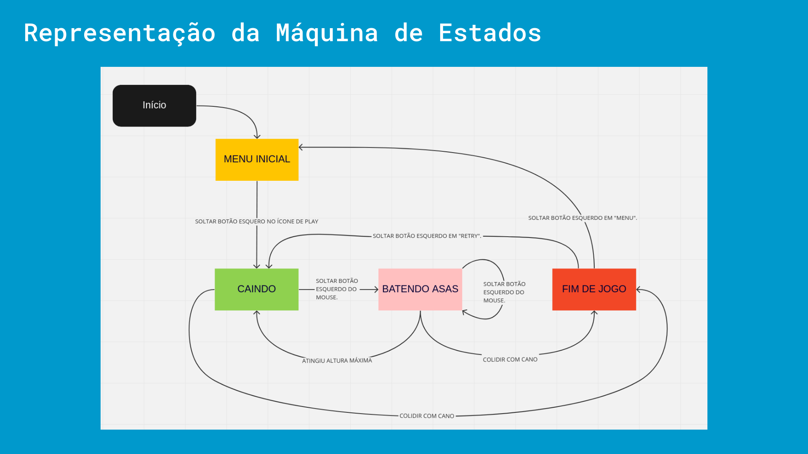
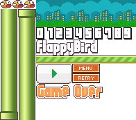

<div align="center">
    <h1>Curso de Programação Orientada a Eventos</h1>
</div>


https://github.com/user-attachments/assets/289b84b1-cf2a-4877-9e95-6935ec86f38a


__Professor:__ Francisco Sant'Anna


__Aluno:__ Arthur Câmara


### Requisitos
* SDL2 >= `2.26.2`
* SDL2_image >= `2.0.5`

_Nota_: Versões menores que a 2.26.2 podem até funcionar mas talvez seja necessário implementar a função [SDL_PointInRect](https://github.com/libsdl-org/SDL/blob/98986f39e97727a80f733f7809ceb80a13697269/include/SDL_rect.h#L73).


### Instalação do SDL2 no Fedora:

```bash
sudo dnf install SDL2-devel SDL2_image-devel
```


### Como compilar o projeto final:

```bash
cd Projeto
gcc main.c -lSDL2 -lSDL2_image && ./a.out > a.txt
```
_Nota_: se sua versão do SDL2 por algum motivo não tiver o `SDL_PointInRect` implementado, compile o programa com a parâmetro `-D SDL_POINTINRECT_NOT_IMPLEMENTED`.

Caso queira ativar o modo de debug para visualizar pontos críticos basta passar o parâmetro `-D DEBUG` para o compilador.


### Máquina de Estados:

<div align="center">
  
</div>


### Sprites:

<div align="center">
  
</div>
